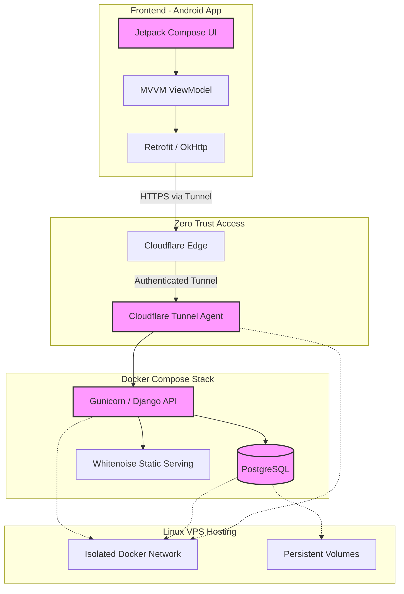

# Technical Architecture

This document provides a visual representation and overview of the technical stack for the Contribs project.

## System Architecture Diagram

## Technical Stack Details

### Backend
- **Framework:** Django 5.x / Django REST Framework
- **Server:** Gunicorn with WhiteNoise
- **Database:** PostgreSQL (Alpine)

### Frontend
- **Framework:** Jetpack Compose (Kotlin)
- **Architecture:** MVVM
- **Networking:** Retrofit / OkHttp

### Infrastructure & Security
- **Hosting:** Hetzner Cloud (Ubuntu 24.04 LTS)
- **Containerization:** Docker Compose
- **Security:** Cloudflare Tunnels (Zero Trust)
