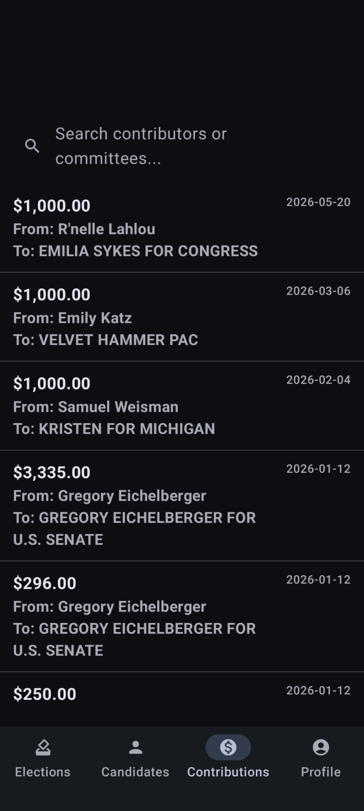
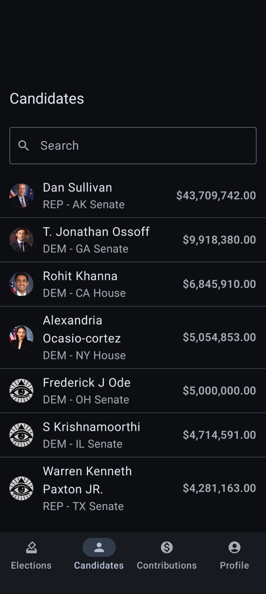

# Contribs.app

## Empowering Financial Transparency in Politics

**Contribs.app** is a free, open-source political contributions **transparency engine** designed to pull back the curtain on election financing. By providing a modern, high-performance interface to complex legislative data, we empower citizens to see exactly where political influence is bought and sold.

### Why Contribs?
- **Follow the Money:** Instantly track contributions from individual donors, corporate committees, and PACs directly to candidates.
- **Election Intelligence:** View aggregated summaries of funding trends across election cycles to understand the big picture.
- **Open-Source Integrity:** Built on a foundation of transparency, our code and data processing workflows are fully open for community audit and improvement.
- **High-Performance Experience:** Utilizing a Jetpack Compose frontend and a robust Django backend, Contribs offers a seamless, mobile-first experience for data exploration.

### Explore the Interface
| | |
|:---:|:---:|
|  |  |
|  |  |

---

### Get Started
Download our latest prototype and start exploring the data today.

[Download the Android APK (Debug)](contribs-debug.apk)

---
*Contribs.app is a non-partisan project dedicated to open data and democratic accountability.*
